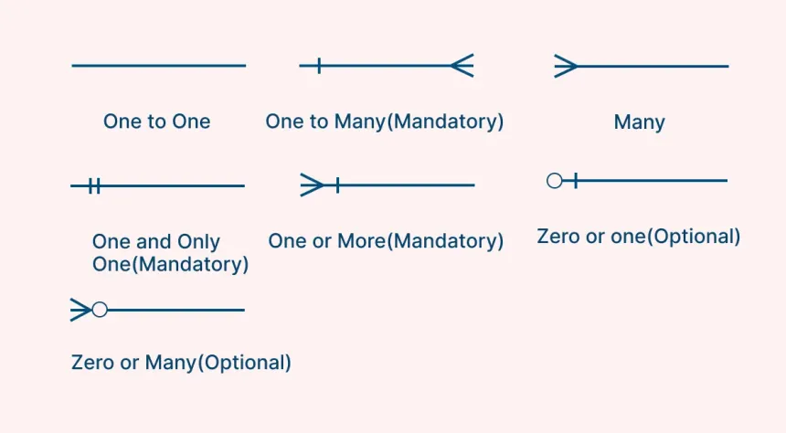
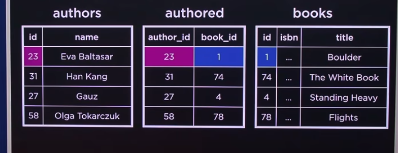

# Relating

- [Relational Database](#relational-database)
- [Relating](#relating)
- [Entity Relationship Diagram](#entity-relationship-diagram)
- [Keys](#keys)
  - [ISBN](#isbn)
  - [Primary Key](#primary-key)
  - [Foreign Key](#foreign-key)
  - [Improving Primary Key](#improving-primary-key)
  - [Many to Many](#many-to-many)
- [Subqueries](#subqueries)
- [IN Keyword](#in-keyword)
- [Relating Flow (Logical Execution)](#relating-flow-logical-execution)
- [JOIN](#join)
  - [ON Keyword](#on-keyword)
  - [INNER JOIN](#inner-join)
  - [LEFT JOIN](#left-join)
  - [RIGHT JOIN](#right-join)
  - [FULL OUTER JOIN](#full-outer-join)
  - [Summary Table](#summary-table)
- [Sets](#sets)
  - [INTERSECT](#intersect)
  - [UNION](#union)
  - [EXCEPT](#except)
- [Groups](#groups)
  - [GROUP BY](#group-by)
  - [HAVING](#having)
- [SUMMARY INTUITION](#summary-intuition)

### relational database

in a database there are the multiple tables inside it... like an author, publisher or whatever relationships inside it

for example:

| Name     | title      |
| -------- | ---------- |
| eva      | boulder    |
| eva      | heavy man  |
| guaz     | white book |
| baltasar | 7 dwarves  |
| baltasar | 163 flight |

### relating

### entity relationship diagram

also called ER Diagrams



this is a relationship

- zero -> doesnt have anything related to something
- one -> something atleast one thing that relates to it at a table
- many -> some entity can have many entity related to it

### keys

this are fundamental idea that relates database one from to another
which has 2 parts primary key and foreign key

#### ISBN

every book has a unique identifier called ISBN like _"073-157842-234"_

- usually when we are finding books to help in finding specific we have this key

#### primary key

- this is similar to primary key to uniquely identify each books or data
  | isbn | title |
  | -------------- | ---------- |
  | 073-157842-234 | Boulder |
  | 978-1234567890 | Heavy Man |

#### foreign key

- is simply taking a primary key to another table

For example, if you have an `authors` table and a `books` table:

authors table

| author_id | name     |
| --------- | -------- |
| 1         | Eva      |
| 2         | Guaz     |
| 3         | Baltasar |

books table

| id  | title      | author_id |
| --- | ---------- | --------- |
| 1   | Boulder    | 1         |
| 2   | Heavy Man  | 1         |
| 3   | White Book | 2         |
| 4   | 7 Dwarves  | 3         |
| 5   | 163 Flight | 3         |

#### improving primary key

- instead of using ISBN _"073-157842-234"_, we can create another primary key called ID that starts with one
  | id | isbn | title |
  |-----|---------------|--------------|
  | 1 | 073-157842-234| Boulder |
  | 64 | 978-1234567890| Heavy Man |
  | 215 | 978-0987654321| White Book |

#### many to many

it will be easier to relate data using primary key in a authored table turnign it into foreign key



### subqueries

- also called nested queries, a query inside anothery query
- You use a subquery when you don't know some data (like the ID), but you know another piece of information (like the name).
- The ID is usually the basis for relationships in the database, so you need it to get related records.
  Subqueries help you find the ID (or other key data) automatically, making your queries more flexible and dynamic.

```sql
SELECT title FROM books
WHERE author_id = (
    SELECT author_id FROM authors
    WHERE name = 'Eva'
);
```

### IN keyword

The IN keyword is mainly used in SQL for querying to filter results where a column’s value matches any value in a list or the result of a subquery. It’s not used for table creation or schema design, only for selecting/filtering data in queries.

Example:

```sql
SELECT * FROM books WHERE id IN (1, 2, 3); -- returns 1,2,3
```

another example for subquerying:

```sql
-- ### without ON like this below just returns one data
SELECT * FROM books WHERE author_id IN (
    SELECT id FROM authors WHERE birth_year > 1950
);
```

### Relating Flow (Logical Execution)

Relating flow in a database is the process of connecting data across multiple tables using relationships (like primary keys and foreign keys). The typical flow is:

1. Identify related tables (e.g., authors and books).
2. Use keys to link records (e.g., author_id in books table refers to id in authors table).
3. Query across tables to get combined or related information (e.g., find all books by a specific author).
4. Use subqueries or joins when you need to fetch related data based on known or unknown values.

### JOIN

- joins is take some tables and temporarily combines it with other tables
- this combines the column of data meaning all instances of that data type

#### ON Keyword

The ON keyword in SQL is used with JOINs to specify the condition for how rows from different tables should be matched

### INNER JOIN


**Shows only data that exists in both tables (the matching part).**

| student_id | name    | grade |
| ---------- | ------- | ----- |
| 1          | Alice   | A     |
| 3          | Charlie | B     |

Only rows that **match** between both tables.

### LEFT JOIN


**Shows all data from the LEFT table, and the matching data from the RIGHT table.**

| student_id | name    | grade |
| ---------- | ------- | ----- |
| 1          | Alice   | A     |
| 2          | Bob     | NULL  |
| 3          | Charlie | B     |

Keeps everyone from the **left** (Students), even if they have no grade.

### RIGHT JOIN


**Shows all data from the RIGHT table, and the matching data from the LEFT table.**

| student_id | name    | grade |
| ---------- | ------- | ----- |
| 1          | Alice   | A     |
| 3          | Charlie | B     |
| 4          | NULL    | C     |

Keeps everyone from the **right** (Grades), even if they have no student.

### FULL OUTER JOIN


**Shows everything from both tables — all matches and non-matches.**

| student_id | name    | grade |
| ---------- | ------- | ----- |
| 1          | Alice   | A     |
| 2          | Bob     | NULL  |
| 3          | Charlie | B     |
| 4          | NULL    | C     |

Combines **everything** - left, right, and matches.

#### SUMMARY TABLE

| JOIN Type       | What It Means             | Keeps From         | Missing Side Fills With |
| --------------- | ------------------------- | ------------------ | ----------------------- |
| INNER JOIN      | Only the matching data    | Both (common part) | —                       |
| LEFT JOIN       | All from left + matches   | LEFT table         | NULL for right          |
| RIGHT JOIN      | All from right + matches  | RIGHT table        | NULL for left           |
| FULL OUTER JOIN | All data from both tables | BOTH tables        | NULL for missing sides  |

**Quick Memory Tip:**

- **INNER** → only inside (common part)
- **LEFT** → keep all left side
- **RIGHT** → keep all right side
- **FULL** → keep everything

### sets

- the idea of set in sql we get back some result, which is called result set we got back from out table
- combine or compare rows (whole result sets)
- A row = data about one entity (like one person, one order, one product).

let say we have a diagram of authors and translators:

#### INTERSECT

- find who are surely a author/translator
- Shows only rows that appear in both tables.

#### UNION or UNION ALL

- find all authors or translator or both author/translator
- Combines rows from both tables.

#### EXCEPT

- subtract something like Authors EXCEPT translator
- so only authors/translator and translator is found

### groups

A group in SQL refers to grouping rows that have the same values in specified columns, usually using the GROUP BY clause.

#### GROUP BY

- GROUP BY is used to group rows that have the same value in one or more column
- then you can apply aggregate functions (like COUNT(), SUM(), AVG(), etc.) to each group.

#### HAVING

this is the alternative version of WHERE but only for GROUP when applying agregate functions

```sql
SELECT "book_id", COUNT("rating") AS 'total ratings'
FROM ratings GROUP BY "book_id"
HAVING "total ratings" < 200; -- it use different keyword for groups to apply and not WHERE
```

### SUMMARY INTUITION

- **JOIN** → Combines data from two or more tables using a related column.
- **INNER JOIN** → Shows only rows that exist in both tables.
- **LEFT JOIN (LEFT OUTER JOIN)** → Shows all rows from the left table and matching ones from the right; missing matches become NULL.
- **RIGHT JOIN (RIGHT OUTER JOIN)** → Shows all rows from the right table and matching ones from the left; missing matches become NULL.
- **FULL OUTER JOIN** → Shows all rows from both tables, matching where possible and filling missing parts with NULL.
- **CROSS JOIN** → Combines every row from one table with every row from another (cartesian product).
- **SELF JOIN** → Joins a table with itself, often for comparisons within the same data.

---

- **UNION** → Combines results from two queries and removes duplicates.
- **UNION ALL** → Combines results from two queries and keeps duplicates.
- **INTERSECT** → Returns only the rows that appear in both results.
- **EXCEPT** → Returns rows from the first result that are not in the second.

---

- **GROUP BY** → Groups rows with the same values to use aggregate functions like COUNT(), SUM(), AVG().
- **HAVING** → Filters groups created by GROUP BY; used for aggregate conditions.
- **WHERE** → Filters rows before grouping or joining.
- **ORDER BY** → Sorts the final result in ascending (ASC) or descending (DESC) order.

---

- **PRIMARY KEY** → Uniquely identifies each record in a table.
- **FOREIGN KEY** → References a primary key in another table to create a relationship.
- **SUBQUERY** → A query inside another query, often used to find related data.
- **IN** → Checks if a value exists within a list or subquery result.

**Quick Intuition:**

- **JOIN** → Combine tables.
- **SET** → Compare results.
- **WHERE** → Filter before grouping.
- **HAVING** → Filter after grouping.
- **GROUP BY** → Summarize similar data.
- **ORDER BY** → Arrange the final results neatly.
